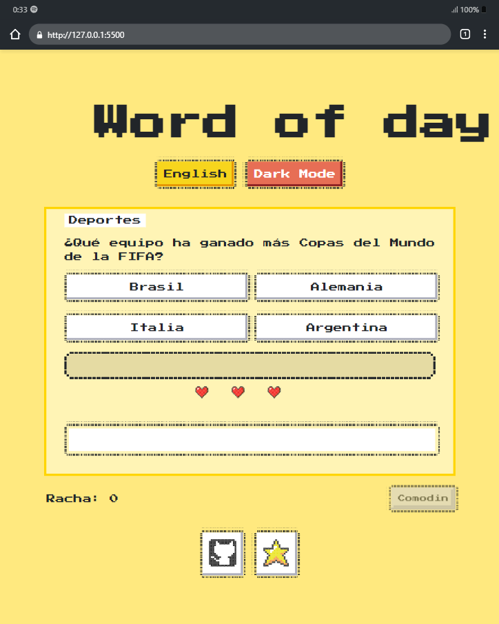

<a id="spanish-section"></a>

<div align="center">

# 🕹️ Word of Day - Juego de Preguntas Retro

[](https://youtu.be/0qag-QTKIQc)

> **¡Responde preguntas, desafía tus conocimientos y alcanza la gloria con un estilo retro inspirado en NES.css!**  
> **Word of Day** es un juego diseñado para fanáticos del diseño clásico y los retos intelectuales.

</div>

---

<div align="center">

## 🌟 Cambiar Idioma / Switch Language
| [English](#english-section) | [Español](#spanish-section) |

</div>

---

<div align="center">

## 🚀 **Características Principales**
</div>

- **🎨 Interfaz Retro:** Diseño inspirado en los clásicos con NES.css.  
- **🧠 Mecánicas Atractivas:** Responde preguntas en diversas categorías, mejora tu racha y gana comodines estratégicos.  
- **🌙 Modo Oscuro:** Alterna entre el modo oscuro y claro para una mejor experiencia visual.  
- **🌎 Idiomas Multilingües:** Cambia de idioma con un solo clic.  
- **⚡ Compatible con Navegadores Modernos.**

---

<div align="center">

## 🎮 **Capturas del Juego**
  
_El diseño retro que te transportará a otra época._

</div>

---

<div align="center">

## 🛠️ **Tecnologías Utilizadas**
</div>

- **HTML5 y CSS3:** Para la estructura y estilo del proyecto.  
- **NES.css:** Biblioteca de diseño retro.  
- **JavaScript Vanilla:** Para la lógica del juego.  
- **Font Awesome:** Iconos personalizables.  
- **[Type](https://type.ieslaarboleda.com):** Estilo clásico con la fuente "Press Start 2P".

---

<div align="center">

## ✨ **Cómo Colaborar**
</div>

1. **Clona el repositorio:**

   ```bash
   git clone https://github.com/Ballwictb/wordofday.git
